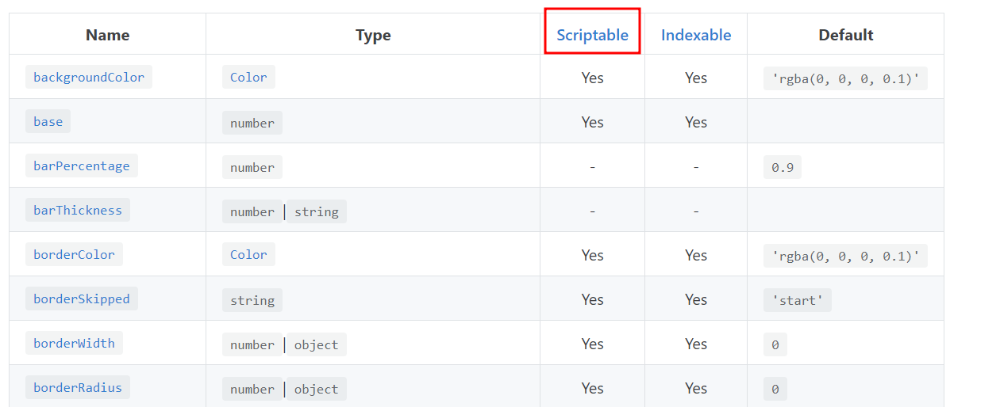

# 1. 기본 chart.html
chart가 들어가는 공간에 부모태그로 감싸는 것이 좋다. 그렇게 하지 않는다면 chart가 무한정으로 커지는 오류가 발생한다.

## chart.js는 크게 3가지 구성으로 이루어져 있다
- data 셋팅 영역(dataset)
- config 설정 영역
- 화면에 그리는 영역

### c.f) documentation에서 Scriptable은 무엇을 의미하는가?


예를들어 backgroundColor는 Scriptable이 'yes'이다
이 속성은 함수로 값을 return이 가능하다는 의미이다.
```js
  const data = {
    datasets: [{
      backgroundColor: [
         'rgba(255, 99, 132, 0.2)',
          'rgba(54, 162, 235, 0.2)',
          'rgba(255, 206, 86, 0.2)',
          'rgba(75, 192, 192, 0.2)',
          'rgba(153, 102, 255, 0.2)',
          'rgba(255, 159, 64, 0.2)'
      ]
    }]
  }

  이게 아래도 가능하다는 말!
  const data = {
    datasets: [{
      backgroundColor: function() {
        return [
         'rgba(255, 99, 132, 0.2)',
          'rgba(54, 162, 235, 0.2)',
          'rgba(255, 206, 86, 0.2)',
          'rgba(75, 192, 192, 0.2)',
          'rgba(153, 102, 255, 0.2)',
          'rgba(255, 159, 64, 0.2)'
      ]
      }
    }]
  }
```